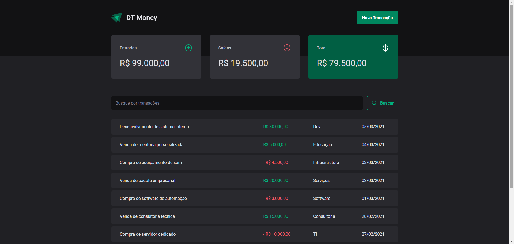

<div align="center">
  
</div>

<p align="center">
  
</p>

<p align="center">
  
  
  
  
  
  
  
</p>

---

## Overview

A personal finance dashboard for tracking income, expenses, and categorized transactions. Built with **React 19**, **TypeScript**, and **Styled Components** for a polished, responsive interface with modal-based transaction creation and summary dashboards.

## Features

- Transaction management (income/expense) with category tagging
- Category-based filtering and search
- Summary dashboard with balance overview
- Modal-based transaction creation with Zod validation
- Responsive design for mobile and desktop
- Component library documented in Storybook

## Tech Stack

| Technology | Purpose |
|---|---|
| **React 19** | UI library |
| **TypeScript** | Type safety |
| **Styled Components** | CSS-in-JS styling |
| **Vite** | Build tool |
| **Zod** | Form validation |
| **Vitest** | Unit testing |
| **Storybook** | Component documentation |

## Getting Started

### Prerequisites

- Node.js 18+
- npm

### Install

```bash
git clone https://github.com/rafaumeu/dt-money.git
cd dt-money
npm install
npm run dev
```

### Docker

```bash
docker compose up -d    # Start on port 5173
docker compose down     # Stop
```

## License

MIT

<div align="center">
  
  <br/><sub>Built with ❤️ by <a href="https://github.com/rafaumeu">Rafael Zendron</a></sub>
</div>

<p align="center">
  <a href="https://github.com/rafaumeu/dt-money/generate"></a>
</p>
